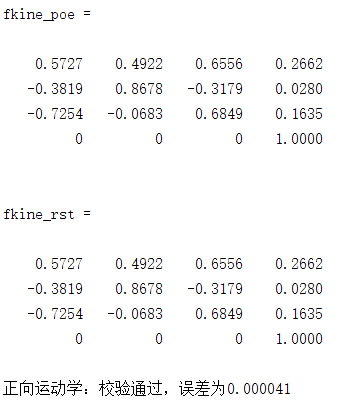
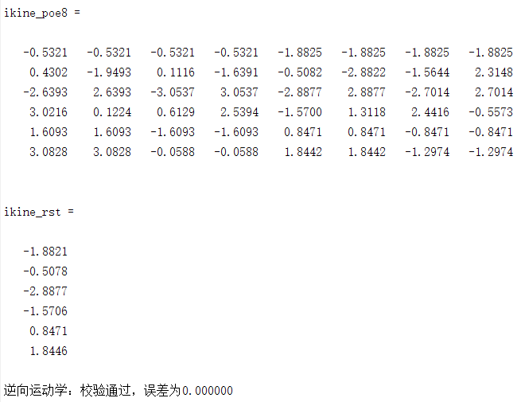
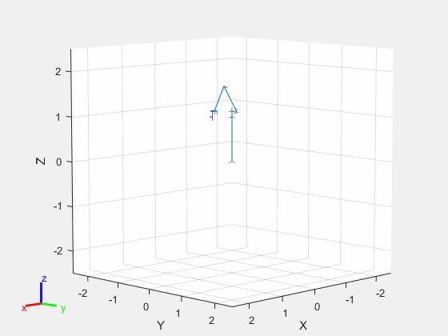
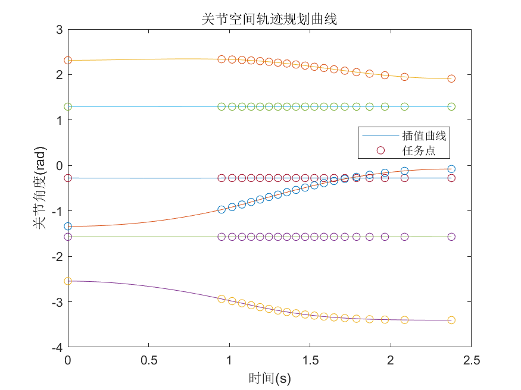

# ME385 机器人学课程项目

## 运动学 Kinematics

- 核心测试程序 [./src/kine_test.m](./src/kine_test.m)
- 正向运动学函数 [./src/myfkine_poe.m](./src/myfkine_poe.m)
- 逆向运动学函数 [./src/myikine_poe8.m](./src/myikine_poe8.m)（生成所有可能逆解）
- 逆向运动学函数 [./src/myikine_poe.m](./src/myikine_poe.m)（生成从给定位置出发得到的关节空间曲线）
- 雅可比矩阵函数 [./src/myJacob0.m](./src/myJacob0.m)（世界坐标系）
- 雅可比矩阵函数 [./src/myJacobe.m](./src/myJacobe.m)（工具坐标系）

## 动力学 Dynamics

- 核心测试程序 [./src/dyn_test.m](./src/dyn_test.m)

## 路径规划 Path planning

- 核心测试程序 [./src/path_test.m](./src/path_test.m)

## 轨迹规划 Trajectory planning

- 核心测试程序 [./src/trajectory_test.m](./src/trajectory_test.m)
- Hermite插值规划函数 [./src/trajectory_Her.m](./src/trajectory_Her.m)
- SQP非线性优化函数 [./src/mySQP.m](./src/mySQP.m)

